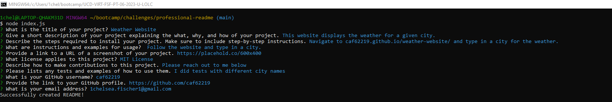

# README Creator

# Description
    -This project involved creating a professional README.
    -The README creator runs in the terminal.
    -When the user answers all the questions in the README Creator, a professional README is created.
       
    
# Installation
    -In order to install this project the user must go to the terminal and type in "node index.js" then follow the prompts on the screen.

    -Follow the following URL to the video that demonstrates installation and usage: https://drive.google.com/file/d/1VewviFHxFT2j7hNRYJdj9LA-pWblvU7n/view?usp=sharing
    
# Usage
    

   
    -In the terminal the user will type node index.js and then a list of questions will arise
    -Once all the questions are answered, a new README will display in Visual Studio Code

   
    
    - This is an example of a README created by the README creator as displayed in VS Code.

# Credits
    Donnie Rawlings: https://github.com/drawlin22/
    Received assistance from AskBCS Jerromy Chance.
    Links to badge images: https://gist.github.com/lukas-h/2a5d00690736b4c3a7ba
   
# License
    N/A